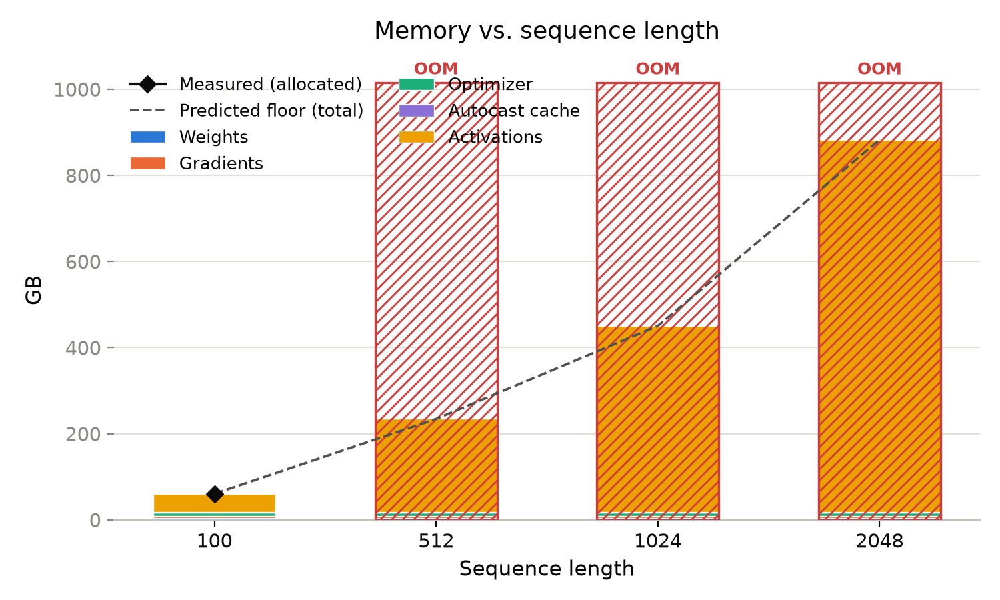

# Training: The Four Line Items of GPU Memory

*Article 1 in a series on sizing GPU infrastructure for foundation models.*

For most predictive models, GPU memory is an afterthought. You train the model, it fits, you move on. Transformer models change that. Memory becomes a primary planning concern, and the decisions that drive it are made before training starts — not discovered hours into a run.

What this article offers is a straightforward way to think about how pre-training choices map to hardware requirements. Model size, sequence length, batch size, and weight representation each push memory in a specific direction. Once you can see which choice drives which cost, you can also see your levers to bring memory down, and what each of those levers costs you.

This article covers training on a single GPU. Multi-GPU strategies are a separate article.

Memory during a full training run comes down to four line items:

**Weights.** The most straightforward. The number of parameters is the number of weights. Your storage precision tells you how many bytes each one takes — and here is the first trap: "BF16 training" almost always means BF16 *compute*, not BF16 *storage*. The stored weights stay in full 32-bit precision (4 bytes), so a 1-billion-parameter model needs about 4 GB to hold the weights, not the 2 GB the label suggests.

**Gradients.** During the backward pass, each weight gets a gradient — the adjustment to apply to that weight. One gradient per weight, same formula as above.

**Optimizer states.** The optimizer controls the learning rate dynamically, and to do that it needs history from earlier training steps. For Adam that history is two full-precision values per weight — momentum and variance — or 8 bytes per weight. (No separate "master copy" of the weights is needed when the weights themselves are already stored in full precision.)

**Activations.** If you naively treat the weights in a model as the coefficients in a system of equations, the activations are the inputs flowing through at a given moment. (This is a stylized example — the real structure is more involved.) Memory here is a function of three choices: sequence length, how long your training examples are in tokens; batch size, how many examples you process at once; and activation checkpointing, which lets you keep a partial record of activations rather than all of them at once. That last one has outsized benefits, with a cost in training time.

The first three line items are static. They do not change whether your batch size is 1 or 4,096. The fourth is dynamic, and it is usually the largest number on the page — often by a wide margin.

---

## The line items, the levers, and what the levers cost

All figures below use one worked configuration, carried through the whole article: **1.01 billion parameters, 20 layers, hidden dimension 2,048, sequence length 100 tokens, batch size 256 examples, BF16 mixed precision (BF16 compute, FP32 storage), standard Adam optimizer.** Figures labeled *measured* come from a 24-configuration benchmark of this model on an H100 80GB — see the note on measurement at the end.

| Line item | Memory | Levers to reduce it | What the lever costs you |
| :---- | :---- | :---- | :---- |
| Weights | 4.0 GB | Fewer parameters; true low-precision storage (rare in training — see below) | A smaller model is a smaller model; low-precision storage risks training instability |
| Gradients | 4.0 GB | Gradient accumulation across micro-batches | Trades wall-clock time for memory; the total memory saved comes from the smaller micro-batch, not from the gradients themselves |
| Optimizer states | 8.1 GB | 8-bit Adam; a stateless optimizer such as SGD | 8-bit Adam carries a small accuracy risk; SGD often converges slower or to a worse result |
| BF16 weight cache | 2.0 GB | None worth pulling — it buys BF16 compute speed; disappears in pure FP32 | Pure FP32 roughly doubles activation memory and forfeits the speedup |
| Activations | \~43 GB | Activation checkpointing; smaller batch size; shorter sequence length | Activation checkpointing adds roughly a third to training time; smaller batches can slow or destabilize convergence; shorter sequences limit what the model can learn |

Two observations. First, optimizer states are twice the weights — the largest static cost, and the one most often left out of a budget; the static items together come to ~18 GB before a single token flows. Second, activations dominate everything else combined, and they are also where your cheapest lever lives.

---

## Running the numbers

### Weights

weight memory \= parameter count × bytes per parameter

Bytes per parameter is set by *storage* precision: 4 bytes for FP32, 2 bytes for BF16 or FP16, 1 byte for INT8. And in a standard mixed-precision recipe, storage precision is FP32: the framework casts weights to BF16 on the fly for each matrix multiply, but the stored weights — the ones this line item counts — never change. True BF16 storage exists but is rare in training, because applying small optimizer updates to low-precision weights loses them.

Worked configuration: 1.01e9 × 4 bytes \= **4.0 GB** (calculated; measured 4.05 GB).

### Gradients

gradient memory \= parameter count × bytes per parameter

Same shape as weights, because there is exactly one gradient per weight, and gradients match the storage precision of their weights: FP32.

Worked configuration: 1.01e9 × 4 bytes \= **4.0 GB** (calculated; measured 4.05 GB).

### Optimizer states

optimizer memory \= parameter count × bytes per parameter of optimizer state

For Adam, two values are held per parameter, both in FP32:

- Momentum (first moment): 4 bytes  
- Variance (second moment): 4 bytes

That is 8 bytes per parameter. Worked configuration: 1.01e9 × 8 bytes \= **8.1 GB** (calculated; measured 8.09 GB).

You may have seen 12 bytes per parameter quoted for Adam. That figure includes a full-precision "master copy" of the weights, which only exists in recipes that store weights in BF16 — the optimizer keeps an FP32 copy so small updates aren't lost, applies updates there, and casts back down. When weights are stored in FP32, as here, the weights are their own master copy and the third term disappears.

Worth noting: mixed precision does not reduce your static memory either way. BF16 weights plus BF16 gradients plus 12 bytes of Adam state is 16 bytes per parameter. FP32 weights plus FP32 gradients plus 8 bytes of plain Adam state is also 16 bytes per parameter. Mixed precision buys you speed and lower activation memory, not a smaller static footprint.

If this line is your constraint, 8-bit Adam stores momentum and variance in 1 byte each instead of 4, taking the total from 8 bytes to roughly 2 bytes per parameter — about **2 GB** for this model. Measured: switching the benchmark to 8-bit Adam cut total training memory by 6.04 GB, within 0.5% of what this arithmetic predicts.

### The BF16 weight cache

One small line item exists only under mixed precision: when autocast casts an FP32 weight to BF16 for a matrix multiply, it caches that BF16 copy for reuse across the rest of the forward pass. The cache is parameter count × 2 bytes — **2.0 GB** here (measured: disabling the cache lowers peak forward memory by 1.98 GB). It disappears in pure FP32 training, and there is no lever worth pulling on it: it is the cost of the BF16 compute speedup, and it releases as soon as the forward pass ends.

### Activations

Activations are the only line item that scales with your data, and they are the reason a model that looks like it needs 16 GB will not fit on a 40 GB card.

activation memory ≈ layers × batch size × sequence length × hidden dimension × bytes per element per layer

Where:

- **layers** is the number of transformer blocks (20 here)  
- **batch size** is examples processed simultaneously (256 here)  
- **sequence length** is tokens per example (100 here)  
- **hidden dimension** is the model's internal width (2,048 here)  
- **bytes per element per layer** is the term that surprises people: roughly **40 to 45 bytes** without activation checkpointing

Worked configuration: 20 × 256 × 100 × 2,048 × 41 bytes ≈ **43 GB** (measured: 42.9 GB on an H100 80GB; see the note on measurement below).

That last constant is where most back-of-the-envelope estimates go wrong. The intuitive guess is 2 bytes per element per layer — one BF16 tensor of shape (batch × sequence × hidden dimension) saved per layer. The real number is roughly twenty times that, because a transformer block does not save one intermediate tensor. It saves fifteen to twenty of them: the layer-norm inputs, the query/key/value projections, the attention output, the feed-forward inputs, and the feed-forward hidden layer, which is typically four times the hidden dimension on its own. All of them are needed again in the backward pass.

If you take one number from this article, take that one. Estimating activations at 2 bytes per element per layer will tell you a job fits when it needs twenty times the memory you budgeted.

#### What "batch" actually means here

Batch size and sequence length both appear as straight multipliers, which means what really drives activation memory is their product: **tokens per batch**, not rows per batch.

For anyone coming from tabular machine learning, this is the trap. A batch of 256 rows sounds small. If each row tokenizes into 100 features, that is 25,600 tokens per batch flowing through every layer. Doubling your feature count has exactly the same memory effect as doubling your batch size.

#### Batch size and sequence length

Both scale activation memory linearly. Halving either one halves this line item.

Going from a batch size of 256 examples to 128 examples takes activations from roughly 43 GB to roughly 21.5 GB (calculated). The other three line items — weights, gradients, optimizer states — do not move at all. They stay at 16.1 GB combined.

Sequence length behaves the same way in the formula above, with one caveat. If your implementation stores the full attention probability matrix, memory grows with the square of sequence length rather than linearly, and long sequences get expensive fast. Memory-efficient attention implementations avoid storing that matrix. If long sequences are a requirement rather than a preference, confirming you have memory-efficient attention is the first thing to check.

#### Activation checkpointing

Activation checkpointing is the highest-leverage decision on this page.

The default behavior is to store every intermediate tensor from the forward pass, because the backward pass needs them to compute gradients. Activation checkpointing stores only the input to each layer and discards the interior. When the backward pass reaches a layer, the framework recomputes that layer's interior from the stored input, uses it, and discards it again.

So instead of holding every layer's full working set at once, you hold:

(layers × batch size × sequence length × hidden dimension × 4 bytes)   ← the saved layer inputs

\+ one layer's full working set, plus the gradient flowing through it   ← the recomputation peak

One trap for estimators: the saved layer inputs are **4 bytes per element even under BF16 mixed precision.** Layer norms and residual additions run in full precision, and the tensor passed *between* layers — which is exactly what checkpointing saves — comes out of those FP32 ops. Budget 4 bytes, not 2, or your dominant term is off by half.

Worked configuration: 4.2 GB of saved layer inputs plus roughly 2.7 GB for the layer being recomputed and its gradients ≈ **6.9 GB** (calculated).

That is roughly 43 GB down to 7 GB — a sixfold reduction on the largest line item in the budget. And at this configuration it shrinks activations so far that they stop setting the peak at all: the run's measured high-water mark, **20.3 GB**, comes from the *optimizer step* — weights, gradients, optimizer state, plus Adam's own update scratch, about 20 bytes per parameter — not from the activations. Once checkpointing is on, that 20-bytes-per-parameter floor is the number a bigger batch has to beat before it costs you anything.

The cost is training time. You are running part of the forward pass twice. In the benchmark run behind this article, per-step time went from 417 ms to 547 ms, a **31% increase** (measured). That is a real cost, but it is predictable, and it is almost always a better trade than not being able to train at all.

---

## Putting it together

Same worked configuration: 1.01 billion parameters, 20 layers, hidden dimension 2,048, sequence length 100 tokens, batch size 256 examples, BF16 mixed precision, standard Adam.

| Line item | Without activation checkpointing | With activation checkpointing |
| :---- | :---- | :---- |
| Weights | 4.0 GB | 4.0 GB |
| Gradients | 4.0 GB | 4.0 GB |
| Optimizer states | 8.1 GB | 8.1 GB |
| BF16 weight cache | 2.0 GB | 2.0 GB (released before the peak) |
| Activations | \~43 GB | \~7 GB (at their own peak) |
| **Peak allocated (measured)** | **59.2 GB** | **20.3 GB** |
| Allocator overhead and CUDA context | \~1.0 GB | \~6.1 GB |
| **Total to size against (measured)** | **60.2 GB** | **26.5 GB** |

The columns do not sum exactly to the peak, and that is not rounding: memory peaks at a *moment*, not as a ledger total. Without checkpointing, everything is resident at once near the end of the forward pass, so the sum is close. With checkpointing, the peak lands on the optimizer step — after the BF16 cache has been released and when almost no activations are alive — so the peak is the 20-bytes-per-parameter optimizer floor, not the column sum.

The practical read: without activation checkpointing, this job needs an 80 GB card and has no room to grow. With it, the same job fits on a 40 GB card with headroom to raise the batch size. One configuration flag moved this training run across a hardware tier.

---

## Checked against hardware

Every formula in this article was validated against a 24-configuration training sweep of the worked model on an H100 80GB, varying batch size, sequence length, optimizer, precision, and checkpointing one lever at a time. For every configuration that completed, predicted memory landed within ~2% of measured; every configuration that ran out of memory was predicted to run out of memory, and none that fit were predicted to OOM.

The measured fit boundaries for the worked 1B-parameter model on the 80 GB card:

| | No levers | With checkpointing |
| :---- | :---- | :---- |
| Batch size (at seq 100) | 256 fits (59.2 GB); 1,024 OOMs | 1,024 fits (40.0 GB); 4,096 OOMs |
| Sequence length (at batch 256) | 100 fits (59.2 GB); 512 OOMs | 512 fits (47.8 GB); 1,024 OOMs |

That table is the whole argument of this article in four cells: the same model, on the same card, either trains or cannot train depending on choices that cost nothing but a config flag — and each lever buys roughly one 4× step in batch or sequence before the wall moves back in.

  
Sequence length is the fastest way to hit the wall: the activation line grows linearly, and by seq 2,048 this model wants ~880 GB — eleven cards' worth — for what looks like a modest config change. The hatched bars are configurations that ran out of memory; the black diamond is the one that fit.

That is the pattern worth internalizing. The static line items are set by decisions you have probably already made — model size, optimizer, precision. The dynamic line item is set by decisions you can still change, and it is usually the one that determines what hardware you need.

---

## What these numbers do not cover

Three honest caveats, because sizing from a number you do not understand is worse than not having it.

**Allocated versus reserved.** The formulas above predict *allocated* memory — bytes held by live tensors. What the driver actually takes from the card is *reserved* memory, which includes cached free blocks and fragmentation. Size your GPU against reserved. The measured gap was about 1 GB in the run without activation checkpointing and about 6 GB with it, since checkpointing frees and reallocates constantly and fragments the pool.

**Ragged batches.** These numbers assume fixed-shape examples. Real batches have variable lengths, and peak memory is driven by the longest sequence in the batch, not the average. If you use dynamic padding, you will run hotter than these predictions.

**Data pipeline memory.** The four line items account for the model. They do not account for your data sitting in GPU memory. GPU-resident pipelines — RAPIDS and cuDF in particular — can hold significant VRAM outside the model, and for smaller models that pipeline can be the dominant consumer. Budget for it separately.

**A note on measurement.** Figures labeled measured come from a 24-configuration training benchmark on a single H100 80GB. The static line items are measured directly — by summing the actual bytes of every parameter, gradient, and optimizer tensor on the device — not inferred. Activations are the difference between two *measured* allocator readings (peak allocated minus allocated after optimizer setup). Peak composition claims (which tensors are alive at the peak moment) come from replaying the CUDA allocator's own event history.

The companion spreadsheet turns this math into a sizing tool — plug in your model size, batch size, and precision, and it tells you whether the job fits on the GPU you have.  
