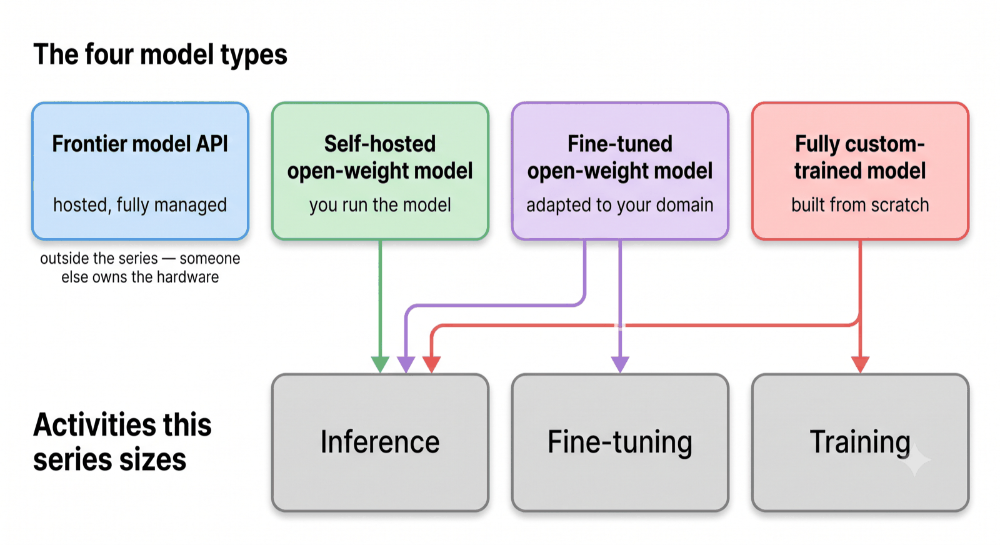

# The Right Model for the Right Job

*Article 0 in a series on sizing GPU infrastructure for foundation models.*

Frontier models have changed what's possible. Work that previously took days now takes hours. But hosted model services will not address every business need — cost, data governance, throughput ceilings, and control over model behavior all limit the ability of these services to address all enterprise AI needs. Open-weight models — now trailing frontier capability by months rather than years — are a game changer. Fine-tuning adds real customization at a favorable total cost of ownership. And, of course, there will still be business cases that demand full model training. The optimal play is no longer a single model; it's an assortment: the right model for the right job.

Model selection — and how that model is trained, customized, and deployed — has direct consequences for your hardware requirements. Considering that demand for GPU capacity routinely outpaces supply, design choices are critical. Selections such as model size, sequence length, batch size, and many more determine how much GPU memory you need and how many GPUs it takes to get there. Your starting point may be the opposite: given the hardware and software available, which models can you actually run, and what choices get you there while still meeting your usage requirements? Regardless of how you are thinking about model development and deployment choices, the work falls into the same three areas: training a model from scratch, fine-tuning an existing model, and serving a model in production.  
We will be issuing an article for each area, along with a working sizing tool. But before sizing anything, let's establish a shared framing: the model types available and the work each one implies.

## The Model Selection Framework

Most IT and AI teams are aware of the four model types: frontier model APIs, self-hosted open-weight models, fine-tuned open-weight models, and fully custom-trained models. What most teams lack is a clear picture of what each option demands in hardware. So they default to whichever one they already have experience with and build the justification afterward. Figure 1 lays out the four types and maps each to the activities you own — the activities this series sizes.

  
Figure 1 shows the four model types, running left to right from most turnkey to most self-managed.

Each model type maps to a set of activities. The exception is the frontier model API, which maps to none — it sits outside this series. The other three all require inference: any model you host, you serve. Fine-tuning applies to the fine-tuned open-weight model. Full training applies to the fully custom-trained model. These activities — training, fine-tuning, and inference — are the work this series sizes. Each gets its own article. Find your model type in Figure 1, follow its arrows, and those are the articles that apply to you.

## Where this series goes next

The series runs the bottom row of Figure 1 in reverse. We start with training because it establishes the fundamentals — the memory line items — that fine-tuning and inference reuse. Build the full picture once, use it three times.

1. **[Training](articles/1-training/article-1-training.md)** — the four line items of GPU memory: weights, gradients, optimizer states, activations. The math for a 1-billion-parameter model, and a spreadsheet to size your own runs before your first out-of-memory error.  
2. **[Fine-tuning](articles/2-finetuning/article-2-finetuning.md)** — what changes when only 1% of the weights are trainable. LoRA adapters, frozen base weights, and QLoRA as a hardware-tier shortcut. Companion spreadsheet at the repo root.  
3. **Inference** — where a different memory consumer, the KV cache, takes over. *(coming soon)*

Each article will ship with a working sizing tool.

---

**Next:** [Training: The Four Line Items of GPU Memory →](articles/1-training/article-1-training.md)

